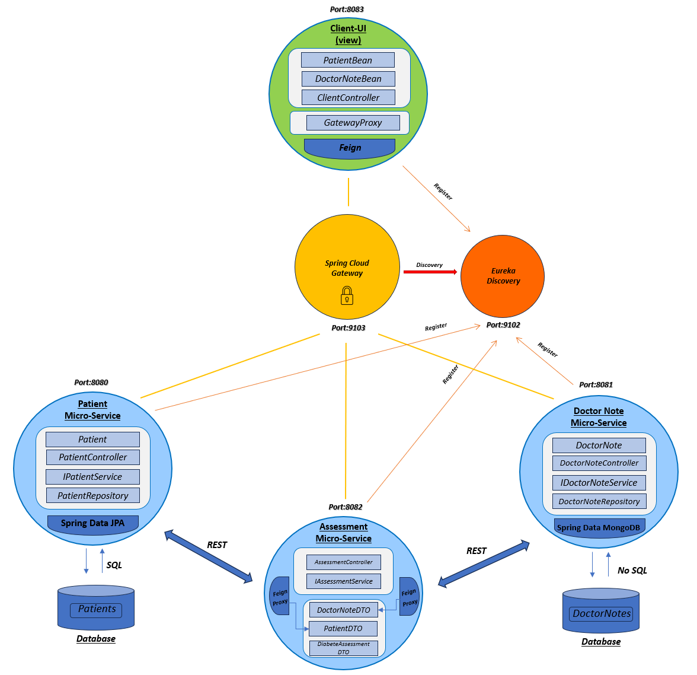
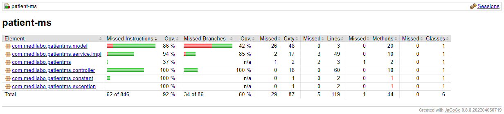
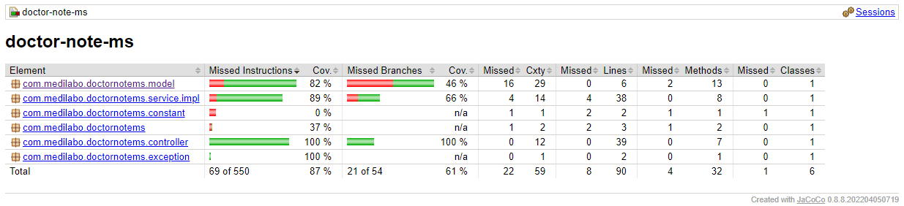
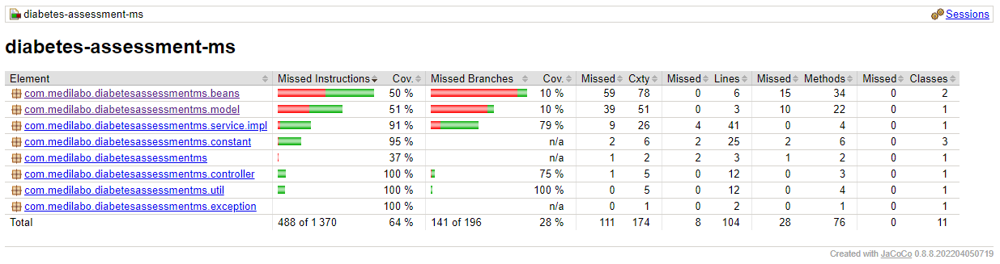
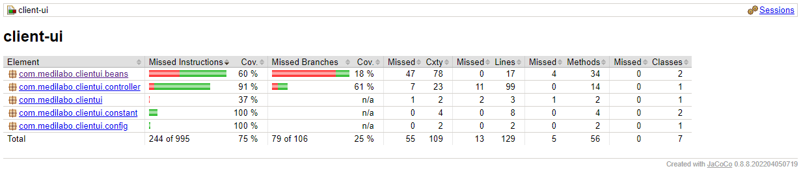

# Medilabo project

Application that allows screening of type 2 diabetes for patients by using their personnals informations and doctor's notes left during consultations.

It is also a tool to see and manage patient informations or see and add notes for practionner.

Diabetes risk level scale -> None / Borderline / In Danger / Early onset

Available for all platforms (PC, tablets, phones)

-------------------------------------------------------------------------------------------------------------------------------------

## Project Structure :

This project is composed of 6 microservices: 

- Front-end:
    
     -> client-ui (web interface)

- Edge microservices:
    
     -> eureka-server (to register other microservices)
     -> gateway-server (to dispatch, filter requests from the view, and also manage security of application)

- Back-end microservices:
    
     -> patient-ms (to manage data about patients)
     -> doctor-note-ms (to manage data about notes from doctor concerning a patient)
     -> assessment-ms (to get risk of diabetes for a patient)
  

-------------------------------------------------------------------------------------------------------------------------------------

## Architectural Model :

All microserservices are registering to eureka-server.
Then request from client view pass through gateway and microservices communicate each other by Feign

-------------------------------------------------------------------------------------------------------------------------------------

## Getting Started :

### Prerequisites :
- Java 17 
- Maven 3.8.7 
- Spring Boot 3.1.4
- MySQL 8.0
- MongoDB
- Docker 

### Running with Docker :

-> Docker needs to be installed (link for installation -> https://docs.docker.com/compose/install/) 

-> Clone this project from Github on your local machine

-> Then you can run "docker-compose up -d" at the root of medilabo project

-> Please wait until that all containers are started and finish running (SQL database is also dockerize, MongoDb not yet)

-> You can see logs with command : "docker logs -f<name of microservice you want to see>", to be sure that everything is well started (can take few minutes because some of them require healthcheck to respect an order)

-> Then go to "http://localhost:8083/client" to get view of application

(security authentication is already made by a FeignConfig class with username "user" and password "password")

-> To stop application you can run command : docker-compose down -v

### Or else :

-> Clone this project from Github on your local machine

-> Create a MySQL server on your local machine with a user (username=pierredb + password=a627a158-1cd5-4ab1-a439-0d4873785246) and give all credentials

-> Then run sql script located in patient-ms (patient-ms/src/main/resources/data.sql) to create database with data

-> Create a MongoDB database "doctornotes" with a collection "doctor_notes" and import data from doctornotes.doctor_notes.json (located in doctor-note-ms/src/main/resources/doctornotes.doctor_notes.json)

-> Then run microservice in this order, from your IDE or the root of microservices by running "mvn spring-boot:run" :
-eureka-server
-gateway-server
-patient-ms
-doctor-note-ms
-diabetes-assessment-ms
-client-ui

-> Then go to "http://localhost:8083/client" to get view of application

(security authentication is already made by a FeignConfig class with username "user" and password "password")

-------------------------------------------------------------------------------------------------------------------------------------

## Coverage of Medilabo microservices:

Tests can be run with maven for each microservice

- patient-ms :

- doctor-note-ms :

- diabetes-assessment-ms :

- client-ui :

-------------------------------------------------------------------------------------------------------------------------------------

## API documentation with Swagger:

- In order to see and test endpoints easily, while application in running on server, go to : 

- "http://localhost:8080/swagger-ui.html" for patient-ms
- "http://localhost:8081/swagger-ui.html" for doctor-note-ms
- "http://localhost:8082/swagger-ui.html" for diabetes-assessment-ms

-------------------------------------------------------------------------------------------------------------------------------------

## Green Code :

Digital has an impact on our natural environment. It is increasing through years because of growing number of terminals (client machines), networks that need to be maintain and also volume of data to handle which is also increasing with better performance of technologies.

Green code is an approach to write code that minimizes energy consumption of software in order to reduce environment impact

### Recommandations for Medilabo project :

- Getting rid of useless features (we already removed externalization of properties that were running on a config-server to reduce energy consumption and also be faster)

- Getting rid of useless data (optional informations from patients like phone number or address for example)

- Refactor code to reduce his length and be more efficient

- Optimize content of application (better to use static content, with lowest quality possible, with small size and limit length of text...)

- We could change JDK image that generate container with docker for a smaller one (we already added a .dockerignore file in each microservices).

- We can deploy mesurement tools like :

  -> EcoIndex (that asses environnment impact of a web page base on her weight, number elements composing it, number of requests)

  -> EcoMeter (that analyse results from EcoIndex base on 15 good practices on web page)
  
  -> Other tools for web or mobile (Ecograder, Mobile Efficiency Index, GreenSpector, mobile enerlytics, Website Speed Test...)

- Finally we could use this checklist of goodpractice, to aim for a better green code (https://s3-eu-west-1.amazonaws.com/course.oc-static.com/courses/6227476/2019-05-Ref-eco_web-checklist.v3.pdf)